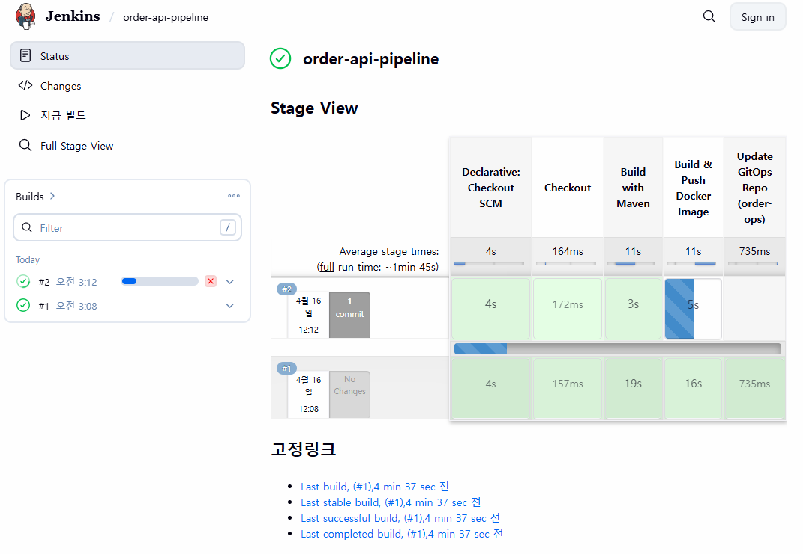
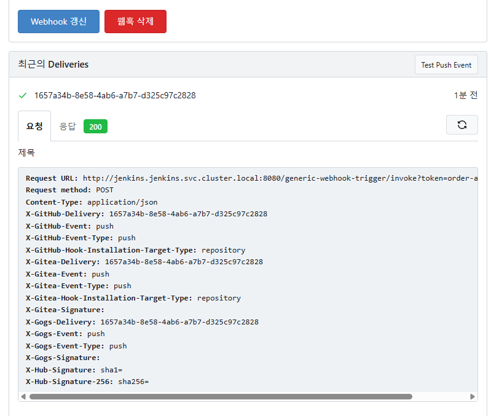
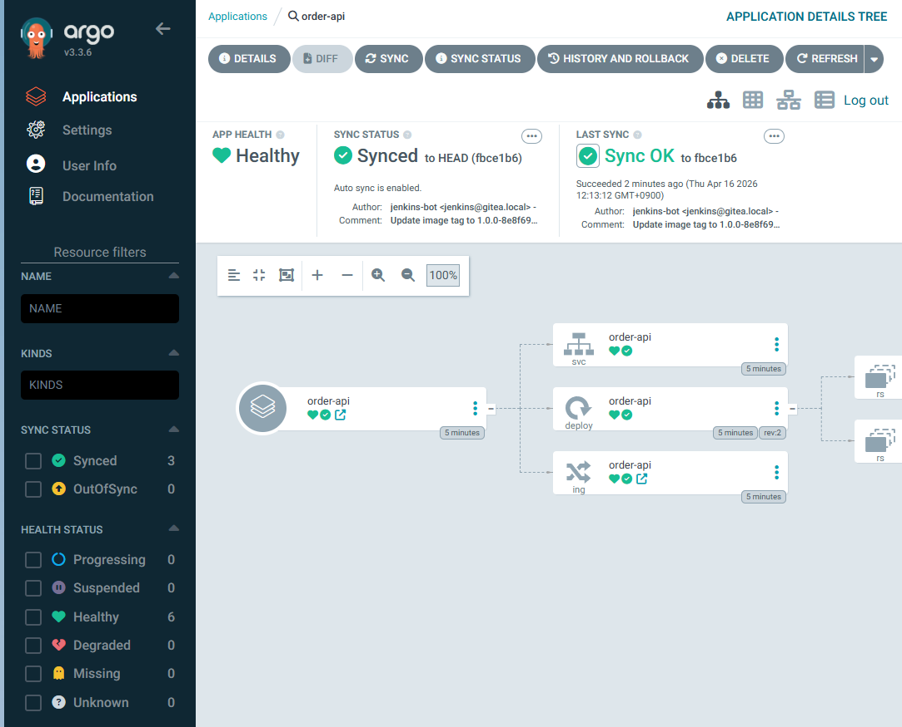
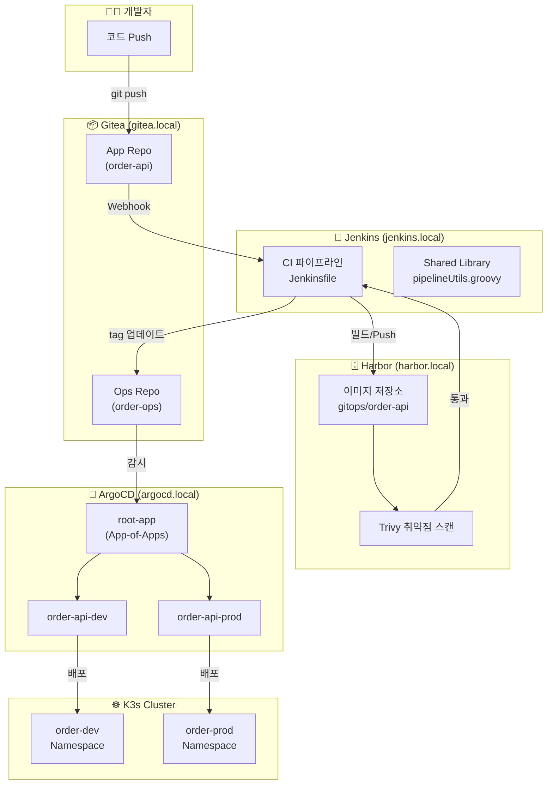
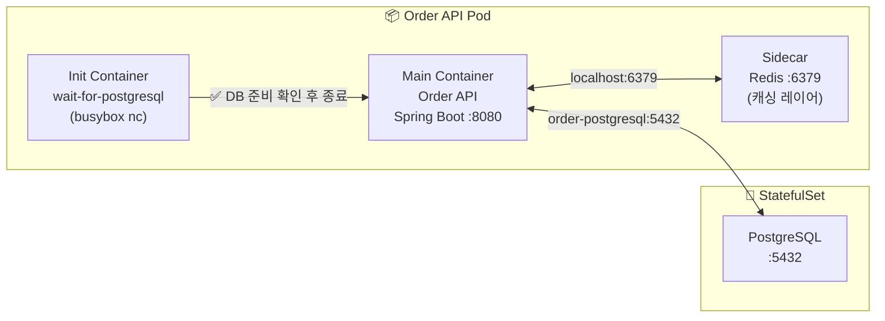

# GitOps Pipeline — Gitea · Jenkins · Harbor · ArgoCD

> Docker Desktop K3s 환경에서 동작하는 완전한 Self-hosted GitOps CI/CD 파이프라인






## 📐 시스템 아키텍처



## 📦 Order System 배포 구조



## 🗂️ 프로젝트 구조

```
gitops-pipeline/
├── .dockerignore
├── .gitignore
├── docker-compose.yml              # 전체 인프라(K3s + Provisioner) 관리
├── README.md
├── docs/                           # 상세 문서 (항목별)
│   ├── 01-architecture.md          # 전체 아키텍처
│   ├── 02-infrastructure-setup.md  # 인프라 구축 가이드
│   ├── 03-gitea-setup.md           # Gitea 설정 가이드
│   ├── 04-jenkins-setup.md         # Jenkins 설정 가이드 (JCasC 중심)
│   ├── 05-harbor-setup.md          # Harbor 설정 가이드
│   ├── 06-argocd-setup.md          # ArgoCD 설정 가이드
│   ├── 07-pipeline-flow.md         # 파이프라인 흐름 설명
│   └── 08-troubleshooting.md       # 문제 해결 가이드
├── infrastructure/
│   ├── k3s/
│   │   └── registries.yaml         # Harbor 신뢰 설정
│   ├── gitea/
│   │   └── values.yaml             # Gitea Helm values
│   ├── jenkins/
│   │   └── values.yaml             # Jenkins Helm values (JCasC 포함)
│   ├── harbor/
│   │   └── values.yaml             # Harbor Helm values
│   └── argocd/
│       └── values.yaml             # ArgoCD Helm values
├── jenkins/
│   ├── shared-library/
│   │   └── vars/
│   │       └── pipelineUtils.groovy # 공통 파이프라인 함수
│   └── pipelines/
│       └── Jenkinsfile              # Order API CI 파이프라인
├── helm-charts/
│   └── order-system/                # 애플리케이션 Helm 차트
├── argocd/
│   ├── app-of-apps/
│   │   └── root-app.yaml           # App-of-Apps 루트
│   └── applications/
│       ├── dev/
│       │   └── order-api-dev.yaml  # Dev Application
│       └── prod/
│           └── order-api-prod.yaml # Prod Application
├── scripts/
│   ├── bootstrap.sh                # 전체 구축 통합 래퍼 (추천!)
│   ├── setup-webhook.sh            # Gitea Webhook 등록 유틸리티
│   ├── teardown.sh                 # 환경 전체 초기화
│   └── steps/                      # 10 단계 모듈화된 구축 스크립트
│       ├── common.sh               # 공통 유틸리티
│       ├── step-01-registry.sh     # 호스트 등록
│       ├── step-02-coredns.sh      # CoreDNS 설정
│       ├── step-03-helm-repos.sh   # Helm 리포지토리 추가
│       ├── step-04-ingress.sh      # Ingress-Nginx 설치
│       ├── step-05-gitea.sh        # Gitea 설치
│       ├── step-06-harbor.sh       # Harbor 설치
│       ├── step-07-jenkins.sh      # Jenkins 설치 (JCasC 자동화)
│       ├── step-08-argocd.sh       # ArgoCD 설치
│       ├── step-09-setup.sh        # 초기 설정 (토큰, 프로젝트, SSH 키)
│       └── step-10-apps.sh         # 앱 배포 및 Webhook 활성화
└── scratch/                        # 개발 중 임시 스크립트 도구함
```

## 🚀 빠른 시작 (Quick Start)

### 1단계: /etc/hosts 설정
로컬 브라우저에서 서비스에 접근하기 위해 호스트 설정을 추가합니다.

> **Windows (관리자 권한으로 실행한 메모장)**: `C:\Windows\System32\drivers\etc\hosts`
> **MacOS/Linux**: `/etc/hosts`

```
127.0.0.1 gitea.local jenkins.local harbor.local argocd.local
```

### 2 단계: 전체 스택 실행
프로젝트 루트에서 다음 명령을 실행하면 K3s 설치부터 GitOps 도구 설정까지 **10 단계의 모듈화된 프로세스**로 자동 진행됩니다.

```bash
bash scripts/bootstrap.sh
```

> [!NOTE]
> `bootstrap.sh` 는 내부적으로 `docker compose up -d` 를 호출하여 인프라 (K3s, Registry) 부터 앱 배포까지 순차적으로 실행합니다. 특정 단계에서 실패할 경우, 해당 단계만 수정 후 `bash scripts/bootstrap.sh` 를 다시 실행하면 실패한 지점부터 자동으로 재개됩니다.

> [!TIP]
> **로그 확인**: 개별 단계의 진행 상황을 확인하려면 아래 명령어를 사용하세요.
> - 전체 흐름: `docker compose logs -f`
> - 특정 단계 (예: Jenkins): `docker compose logs -f step-07-jenkins`
> - Step 10(Jenkins 빌드 + ArgoCD sync): `docker compose logs -f step-10-apps`
> - bootstrap.sh 로그: `bash scripts/bootstrap.sh` 실행 시 콘솔 출력

> [!IMPORTANT]
> **Step 10 에서 Jenkins 빌드가 완료된 후 ArgoCD 가 sync 됩니다.**
> - Jenkins 빌드가 완료되어 Harbor 에 Docker 이미지가 Push 되어야 ArgoCD 가 Pod 를 정상적으로 배포합니다.
> - 만약 `ImagePullBackOff` 오류가 발생하면, Jenkins 빌드가 완료될 때까지 기다린 후 ArgoCD 에서 수동으로 `SYNC`를 실행하세요.

### 3 단계: 구축 완료 확인
모든 컨테이너가 `Exited (0)` 상태 (작업 완료) 가 되면 아래 접속 주소로 이동하여 시스템을 확인합니다.

**추천 확인 순서:**

1. **Jenkins** 에서 빌드 상태 확인
   - http://jenkins.local → `order-api-pipeline` Job 확인
   - **자동 설정 완료**: JCasC를 통해 `jenkins-bot` 계정과 SSH 자격증명이 이미 등록되어 있습니다.
   - 빌드가 실행 중이면 완료될 때까지 대기 (약 5-10 분)

2. **Harbor** 에서 Docker 이미지 확인
   - http://harbor.local → `gitops` 프로젝트 → `order-api`
   - 최신 태그의 이미지가 Push 되었는지 확인

3. **ArgoCD** 에서 애플리케이션 동기화 확인
   - http://argocd.local → `order-api-dev` Application
   - 상태가 `Healthy` 이고 `Synced` 인지 확인
   - `ImagePullBackOff` 오류 시 Jenkins 빌드 완료 후 `SYNC` 실행

> [!NOTE]
> K3s 내부 네트워크 통신 최적화를 위해 Gitea SSH 는 `2222` 포트를 사용하도록 설정되어 있습니다.

## 🌐 접속 주소

| 서비스     | URL                  | 기본 계정                          |
| ------- | -------------------- | ------------------------------ |
| Gitea   | http://gitea.local   | gitea-admin / Gitea@Admin2024! |
| Jenkins | http://jenkins.local | admin / Jenkins@Admin2024!     |
| Harbor  | http://harbor.local  | admin / Harbor12345            |
| ArgoCD  | http://argocd.local  | admin / ArgoCD@Admin2024!      |

## 🧹 환경 초기화 (Teardown)

테스트를 완료한 후 혹은 문제가 생겨 모든 상태 (K3s 클러스터, 데이터베이스, 로컬 `.git` 이력 등) 를 백지 상태로 초기화하려면 다음 스크립트를 실행하세요.

```bash
bash scripts/teardown.sh
```

이 스크립트는 이전에 생성된 Docker 볼륨을 삭제하고 파이프라인에서 생성했던 토큰이나 `apps/` 경로의 깃 이력들을 안전하게 제거하여 다시 `bash scripts/bootstrap.sh` 를 구동할 수 있도록 환경을 청소해 줍니다.

### 특정 Step 부터 재시작

특정 단계에서 실패했거나, 해당 단계만 재실행하고 싶은 경우:

```bash
# Step 07(Jenkins 설치) 부터 재시작
docker compose up -d step-07-jenkins

# Step 10(Apps & ArgoCD) 부터 재시작
docker compose up -d step-10-apps

# 또는 bootstrap.sh 재실행 (자동으로 완료된 step 은 skip)
bash scripts/bootstrap.sh
```

---

## 🧪 완전 자동화된 GitOps 테스트 가이드

`bash scripts/bootstrap.sh` 실행 후, 아래 순서로 각 단계를 검증하세요.

> [!IMPORTANT]
> **전제 조건**: Step 10 로그에서 `✅ Jenkins Job 'order-api-pipeline' 존재 확인` 메시지가 출력된 이후부터 아래 검증을 진행하세요.
> ```bash
> docker compose logs -f step-10-apps
> ```

---

### 1단계 — Jenkins Webhook 트리거 & 빌드 확인

Step 10 이 완료되면 `order-api` 소스 push 가 이미 발생한 상태입니다. Jenkins 가 Webhook 을 정상 수신했다면 빌드가 자동으로 시작됩니다.

1. [http://jenkins.local](http://jenkins.local) 접속 (`admin` / `Jenkins@Admin2024!`)
2. `order-api-pipeline` Job 클릭 → 빌드 번호 `#1` 이 실행 중 또는 완료 상태인지 확인
3. 빌드가 보이지 않으면 **Webhook 미수신** 상태입니다. 아래 진단 명령을 실행하세요.

```bash
# Gitea Webhook 목록 및 최근 전송 이력 확인
curl -s http://gitea.local/api/v1/repos/gitops/order-api/hooks \
  -u gitea-admin:Gitea@Admin2024! | jq '.[] | {id, url: .config.url, active, last_status: .last_status}'

# Jenkins Pod 로그에서 Webhook 수신 여부 확인
JENKINS_POD=$(kubectl get pods -n jenkins -l app.kubernetes.io/instance=jenkins \
  -o jsonpath='{.items[0].metadata.name}')
kubectl logs -n jenkins "$JENKINS_POD" --tail=100 | grep -i "webhook\|generic\|trigger"
```

> [!TIP]
> **Webhook 자동화**: 본 프로젝트는 `Generic Webhook Trigger` 플러그인을 사용하여 Jenkins가 Gitea의 Webhook을 토큰 기반(`order-api-token-2024`)으로 수신하도록 미리 설정되어 있습니다. (JCasC 설정 참고)

수동으로 빌드를 트리거할 수도 있습니다:
```bash
# JCasC 보안 설정에 따라 현재 익명 빌드 트리거가 허용되어 있습니다.
curl -X POST "http://jenkins.local/generic-webhook-trigger/invoke?token=order-api-token-2024"
```

---

### 2단계 — Harbor 이미지 Push 확인

Jenkins 빌드의 `Build & Push Docker Image` 스테이지가 성공하면 Harbor 에 이미지가 등록됩니다.

1. [http://harbor.local](http://harbor.local) 접속 (`admin` / `Harbor12345`)
2. `gitops` 프로젝트 → `order-api` 저장소에 태그(`1.0.0-<commitHash>`)가 있는지 확인

```bash
# CLI 로 확인 (Jenkins Pod 내부 경유)
JENKINS_POD=$(kubectl get pods -n jenkins -l app.kubernetes.io/instance=jenkins   -o jsonpath='{.items[0].metadata.name}')
kubectl exec -n jenkins "$JENKINS_POD" --   curl -s -u admin:Harbor12345   "http://harbor.harbor.svc.cluster.local:80/api/v2.0/projects/gitops/repositories/order-api/artifacts"   | jq '.[].tags[].name' 2>/dev/null || echo "이미지 없음 — Jenkins 빌드 완료를 기다리세요"
```

> [!NOTE]
> Harbor 에 이미지가 없는 상태에서 ArgoCD 가 sync 되면 `ImagePullBackOff` 가 발생합니다.
> **반드시 Jenkins 빌드가 SUCCESS 된 이후에 3단계로 진행하세요.**

---

### 3단계 — ArgoCD 자동 동기화 확인

Jenkins 빌드 마지막 스테이지(`Update GitOps Repo`) 에서 `order-ops` 의 `values.yaml` 이미지 태그가 업데이트되면 ArgoCD 가 Webhook 을 통해 즉시 감지합니다.

1. [http://argocd.local](http://argocd.local) 접속

   - ArgoCD 초기 admin 비밀번호 확인:
     ```bash
     kubectl get secret argocd-initial-admin-secret -n argocd        -o jsonpath='{.data.password}' | base64 -d && echo
     ```

2. `root-app` → `order-api-dev` Application 의 상태가 `Synced` + `Healthy` 인지 확인
3. `ImagePullBackOff` 가 발생한다면 아직 이미지가 없는 것이므로, Harbor 이미지 확인 후 수동 Sync:

```bash
# ArgoCD CLI 로 수동 sync
kubectl exec -n argocd deployment/argocd-server --   argocd app sync order-api-dev --insecure   --server argocd-server.argocd.svc.cluster.local   --auth-token "$(kubectl get secret argocd-initial-admin-secret -n argocd     -o jsonpath='{.data.password}' | base64 -d)"
```

---

### 4단계 — 최종 서비스 응답 확인

ArgoCD 배포가 완료되면 아래 명령으로 서비스를 검증합니다.

```bash
curl -H "Host: order.local" http://127.0.0.1/api/order
```

정상 응답:
```json
{"version":"v1.0.0","message":"Order API is running fine.","status":"success"}
```

Pod 상태 확인:
```bash
kubectl get pods -n order-dev
kubectl get ingress -n order-dev
```

---

### 5단계 — E2E 코드 변경 → 자동 배포 테스트

전체 GitOps 루프를 직접 경험해 보세요.

**① 저장소 Clone**

```bash
git clone http://gitea.local/gitops/order-api.git
cd order-api
# 인증: gitea-admin / Gitea@Admin2024!
```

**② 코드 수정**

`src/main/java/com/example/api/OrderController.java` 를 열어 응답 메시지를 변경합니다.

```java
// 기존
response.put("message", "Order API is running fine.");
// 변경
response.put("message", "GitOps Auto Deployment is working!");
response.put("version", "v1.1.0");
```

**③ Push**

```bash
git add .
git commit -m "feat: API 메시지 v1.1.0 업데이트"
git push origin main
```

**④ 자동 파이프라인 모니터링**

| 단계 | 확인 위치 | 예상 결과 |
|------|-----------|-----------|
| Webhook 수신 | Jenkins → `order-api-pipeline` | 새 빌드 번호 생성 |
| 이미지 빌드 | Jenkins 빌드 로그 | `Building and Pushing Image via Kaniko` |
| Harbor Push | harbor.local → `gitops/order-api` | 새 태그 `1.0.0-<hash>` |
| ops 태그 업데이트 | Gitea → `order-ops` → `helm-charts/order-api/values.yaml` | `tag: 1.0.0-<hash>` 로 커밋 |
| ArgoCD Sync | argocd.local → `order-api-dev` | `Syncing` → `Healthy` |

**⑤ 최종 확인**

```bash
# 수 분 후 재요청
curl -H "Host: order.local" http://127.0.0.1/api/order
# 기대 응답: "GitOps Auto Deployment is working!"
```

---

### 🔍 트러블슈팅 빠른 참조

| 증상 | 원인 | 해결 |
|------|------|------|
| Jenkins 빌드가 시작 안 됨 | Webhook 미수신 또는 Job 트리거 미설정 | `setup-webhook.sh` 재실행, Job 트리거 확인 |
| `ImagePullBackOff` | Harbor 에 이미지 없음 | Jenkins 빌드 완료 후 ArgoCD 수동 Sync |
| ArgoCD `OutOfSync` 유지 | order-ops Webhook 미등록 또는 토큰 만료 | `step-09-setup` 재실행 |
| SSH clone 실패 | `gitea-ssh-credentials` 시크릿 불일치 | `step-09-setup` 재실행 후 Jenkins Pod 재시작 |
| `maven-cache-pvc` 없음 | step-09 미완료 | `kubectl apply` 로 PVC 수동 생성 |

```bash
# 각 step 로그 확인
docker compose logs step-09-setup
docker compose logs step-10-apps

# Jenkins Pod 재시작 (Secret 재로딩)
kubectl delete pod -n jenkins -l app.kubernetes.io/instance=jenkins

# Webhook 재등록
bash scripts/setup-webhook.sh
```

## 📚 상세 문서

각 컴포넌트의 상세 설정 가이드는 `docs/` 폴더를 참고하세요.

| 문서 | 내용 |
|------|------|
| [01-architecture.md](docs/01-architecture.md) | 전체 시스템 아키텍처 |
| [02-infrastructure-setup.md](docs/02-infrastructure-setup.md) | 인프라 구축 가이드 |
| [03-gitea-setup.md](docs/03-gitea-setup.md) | Gitea 설정 가이드 |
| [04-jenkins-setup.md](docs/04-jenkins-setup.md) | Jenkins 설정 가이드 |
| [05-harbor-setup.md](docs/05-harbor-setup.md) | Harbor 설정 가이드 |
| [06-argocd-setup.md](docs/06-argocd-setup.md) | ArgoCD 설정 가이드 |
| [07-pipeline-flow.md](docs/07-pipeline-flow.md) | 파이프라인 흐름 설명 |
| [08-troubleshooting.md](docs/08-troubleshooting.md) | 문제 해결 가이드 |

## 🔧 문제 해결

| 문제 | 해결 방법 |
|------|-----------|
| `ImagePullBackOff` | Jenkins 빌드 완료 대기 후 ArgoCD `SYNC` 실행 |
| Step 실패 | `docker compose logs step-XX-<name>` 으로 로그 확인 |
| ArgoCD sync 실패 | Gitea 토큰 만료 확인, `step-09-setup` 재실행 |
| Jenkins 웹훅 미동작 | Gitea Webhook 설정 재확인 (`setup-webhook.sh`) |

자세한 문제 해결 방법은 [08-troubleshooting.md](docs/08-troubleshooting.md) 를 참고하세요.
