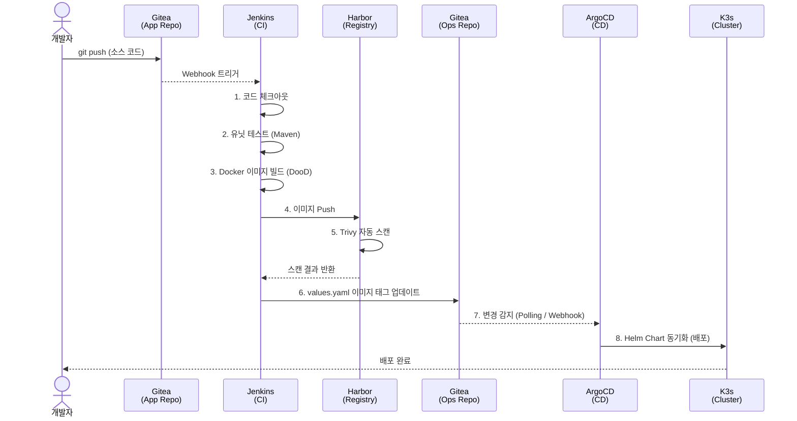
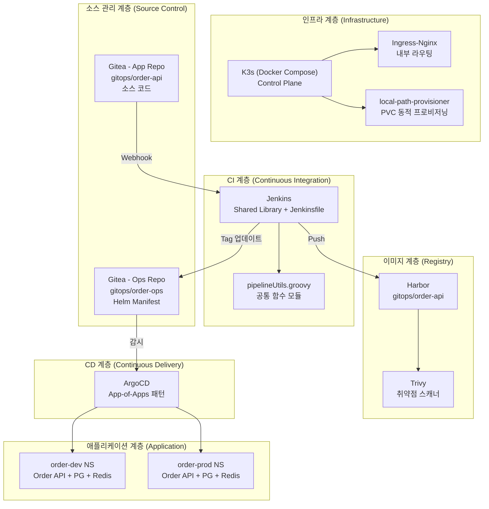
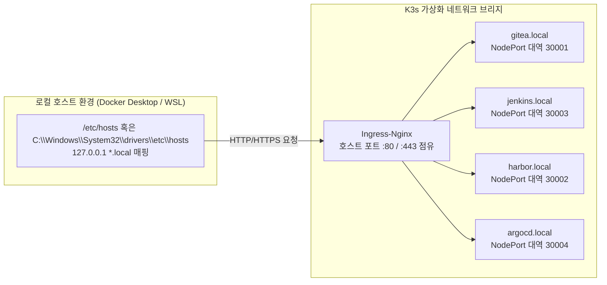

# 01. 전체 아키텍처

## 개요

본 프로젝트는 Docker Desktop 위에서 동작하는 K3s 클러스터를 기반으로, Self-hosted 도구들(Gitea, Jenkins, Harbor, ArgoCD)만을 사용하여 완전한 GitOps 파이프라인을 구현합니다. 이 문서는 각 도구 간의 상호작용과 전체적인 배포 흐름, 네트워크 레이어 및 애플리케이션 아키텍처에 대해 상세히 설명합니다.

---

## 1. 전반적인 CI/CD (GitOps) 데이터 파이프라인 흐름

아래의 시퀀스 다이어그램은 개발자가 소스 코드를 푸시하는 시점부터, 실제 운영 서버(K3s 클러스터)에 애플리케이션이 배포되기까지의 전체 절차를 나타냅니다.

### 🧩 절차 상세 설명
1. **코드 연동 (Push 단계)**: 개발자가 Gitea에 위치한 `App Repo` (주로 비즈니스 로직을 담은 소스 코드, 예: `order-api`)로 수정 사항을 반영(Push)하면, Gitea는 등록된 Webhook을 통해 Jenkins로 빌드를 시작하라는 트리거 신호를 전송합니다.
2. **CI 빌드 및 테스트**: Jenkins는 코드를 클론하고 저장소 내의 `Jenkinsfile`에 명시된 파이프라인을 구동합니다. Java/Spring 환경이므로 Maven 컨테이너 위에서 유닛 테스트와 패키징 작업을 수행합니다.
3. **도커라이징 및 시큐리티 스캔**: 컴파일이 성공된 빌드 산출물은 Docker 이미지로 묶이게 되며 (DooD - Docker out of Docker 통신 활용), 즉시 Harbor 프라이빗 레지스트리로 배포(Push) 됩니다. 이후 Harbor 내에 통합된 Trivy 스캐너가 보안 취약점을 자동으로 검사합니다.
4. **Ops Repository Manifest 갱신**: 도커 이미지 검증까지 모두 정상 종료되면, 파이프라인의 최종 단계로서 Jenkins는 쿠버네티스 배포 설정인 Helm Chart 들이 모여있는 `Ops Repo`를 클론해옵니다. 이 중 `.Values.image.tag`에 해당하는 값을 방금 빌드된 새 이미지의 해시값(Commit ID 등)으로 자동 치환 및 커밋하여 봇 계정으로 푸시합니다.
5. **ArgoCD를 통한 동기화**: `Ops Repo`의 변경 내역을 주기적으로 감시하고 있던 ArgoCD는 변경 내용을 감지하고, 실제 K3s 내부의 현재 런타임 상태와 명세(Manifest) 간의 불일치를 확인합니다. 그 후 새 이미지 버전을 런타임에 직접 반영 업데이트(`Sync`)를 수행함으로써 파이프라인의 자동 배포 주기가 완성됩니다.

---

## 2. 레이어별 논리적 계층 구조

각 요소가 맡은 고유 기능과 컴포넌트 간 책임을 수직적으로 계층화한 아키텍처 다이어그램입니다.

### 🧩 구조 상세 설명
- **인프라 계층**: 기반이 되는 뼈대로서 K3s Control Plane이 구동되며, 외부의 사용자 HTTP 요청을 포워드하기 위해 Nginx-Ingress를 기본으로 사용합니다. 영구적인 스토리지 저장(Jenkins Workspace, Database 파일 등)을 위해 로컬 디스크를 자동 프로비저닝하는 `local-path-provisioner`를 채용하였습니다.
- **소스 관리 / CI 계층**: Self-hosted 저장소를 구성하기 위해 가벼운 Gitea를 채택하고, 그 트리거를 받아들이는 Jenkins 인스턴스를 통해 CI 파이프라인의 코어 역할을 수행하고 있습니다.
- **이미지 / CD 계층**: CI를 성공적으로 마친 컨테이너 이미지를 보관하고 검증하기 위한 OCI 규격 저장소(Harbor) 계층입니다. 동시에 CD를 책임지는 ArgoCD는 선언적인 인프라 정의(Declarative Infrastructure) 원칙을 K3s 클러스터 내부에 강제하는 컨트롤러 역할을 담당합니다. 
- **애플리케이션 계층**: 파이프라인의 종착 목적지입니다. GitOps의 App-of-Apps 패턴에 따라 ArgoCD로부터 관리받으며, 추후 `order-dev` 혹은 `order-prod` 와 같이 분리된 Kubernetes Namespace 위에서 격리 구동될 수 있습니다.

---

## 3. 리포지토리 분리 운영 모델 전략

GitOps 베스트 프랙티스 도입을 바탕으로 애플리케이션 소스 코드 레포지토리와 Kuberentes 인프라 배포 설정 레포지토리를 철저히 분할 운영합니다.

| 구분 | 리포지토리 예시 | 주요 취급 파일 | 직접 변경 주체 |
|------|----------|------|----------|
| **App Repo** | `gitops/order-api` | 소스 모듈, Dockerfile, Jenkinsfile | 비즈니스 로직 작성자 (개발자) |
| **Ops Repo** | `gitops/order-ops` | Helm Chart 정의, ArgoCD YAML | Jenkins 자동화 CI 파이프라인 (봇 계정) |

### 🧩 리포지토리 분리가 필수적인 이유
1. **명확한 책임 단위 지정**: 서비스 소스의 변경 이력(App Repo의 Commit Log)과 애플리케이션의 운영 인프라 핫픽스/업데이트 내역(Ops Repo Log)이 철저히 분리되므로 버전 관리가 명확해지고 특정 K8s 리소스 상태로의 롤백 수행 시 혼동되지 않습니다.
2. **트리거 무한 루프 충돌 차단**: CI 동작의 아웃풋은 필연적으로 "새로운 Docker 이미지 템플릿의 업데이트"를 초래합니다. 만약 이 두 요소가 한 저장소에 혼합되어 있다면 CI 빌드봇의 Tag 업데이트 푸시가 다시 CI 파이프라인을 불필요하게 트리거하는 이른바 '루프 충돌' 장애를 일으킬 우려가 있습니다.
3. **유연한 접근 권한 분할**: App 개발팀에게는 소스코드 푸시 권한(`App`)만을 열어주고, 인프라 담당(SRE, DevOps 팀)이나 권한 확인을 거친 봇 시스템에게만 프로덕트 배포 설정(`Ops`)을 허용하는 권한 최소화(Principle of least privilege) 통제가 가능해집니다.

---

## 4. 네트워크 통신 및 라우팅 접근

호스트 머신과 내부 클러스터 컨테이너 시스템 간 연결 구조입니다.

### 🧩 네트워크/라우팅 가이드
- **호스트 환경 진입점 기반 통신**: 프로젝트의 모든 DevOps 도구들은 물리 서버 호스트 네트워크의 `hosts` 파일을 기반으로 DNS 조회를 가로채는(`127.0.0.1`) 방식의 가상의 `.local` 확장 도메인에 의존합니다. 이렇게 변환된 요청은 Docker 컨테이너인 K3s 인스턴스로 즉각 넘겨집니다.
- **NodePort 와 Ingress의 조합 트래픽**: Nginx-Ingress 컨트롤러를 가장 바깥쪽 리버스 프록시 레이어로 배치해 호스트의 글로벌 `:80` 포트에 수신된 HTTP 파이프라인 도구 접속을 Gitea, Jenkins, Harbor, ArgoCD 등 각각의 백엔드 타겟인 `NodePort`로 동적으로 내부 라우팅해주는 형태입니다.
