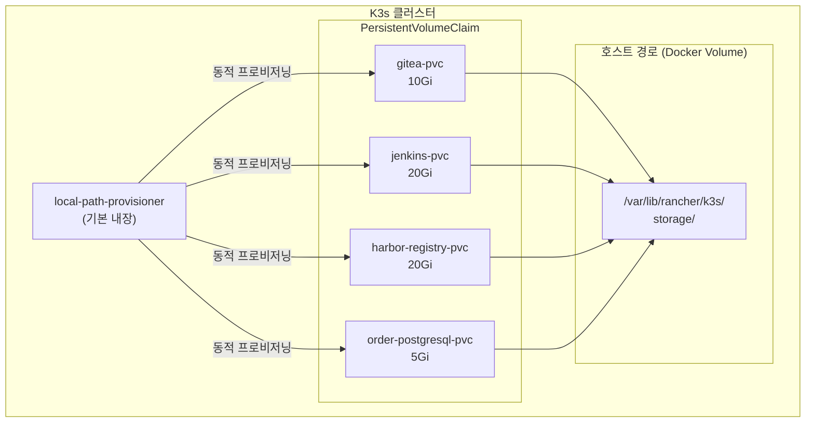

# 02. 인프라 구축 가이드 (K3s + Ingress-Nginx)

## 사전 요구사항

| 항목 | 최소 사양 |
|------|----------|
| Docker Desktop | v4.20 이상 |
| CPU | 4코어 이상 |
| RAM | 8GB 이상 (K3s + 도구 합산) |
| 디스크 | 30GB 이상 여유 공간 |
| kubectl | v1.28 이상 |
| Helm | v3.14 이상 |

---

## 1단계: K3s 클러스터 시작

```bash
cd infrastructure/k3s

# K3s 컨테이너 시작
docker compose up -d

# 기동 대기 (약 60초)
docker compose logs -f k3s-server | grep -m1 "Node controller sync successful"
```

### kubeconfig 설정

```bash
# 자동 생성된 kubeconfig를 호스트에서 사용
export KUBECONFIG=$(pwd)/output/kubeconfig.yaml

# 또는 기본 경로로 복사
mkdir -p ~/.kube
cp output/kubeconfig.yaml ~/.kube/config

# 클러스터 연결 확인
kubectl get nodes
# NAME         STATUS   ROLES                  AGE   VERSION
# k3s-master   Ready    control-plane,master   1m    v1.29.4+k3s1
```

---

## 2단계: Harbor 레지스트리 신뢰 설정

K3s가 Harbor에서 이미지를 Pull할 때 인증서 오류가 발생하지 않도록 설정한다.

```bash
# registries.yaml을 K3s 컨테이너 내부로 복사
docker cp infrastructure/k3s/registries.yaml \
  k3s-server:/etc/rancher/k3s/registries.yaml

# K3s 서비스 재시작 (설정 적용)
docker exec k3s-server systemctl restart k3s

# 재시작 완료 대기
sleep 30
kubectl get nodes
```

---

## 3단계: Ingress-Nginx 설치

```bash
helm repo add ingress-nginx https://kubernetes.github.io/ingress-nginx
helm repo update

helm upgrade --install ingress-nginx ingress-nginx/ingress-nginx \
  --namespace ingress-nginx \
  --create-namespace \
  --set controller.service.type=NodePort \
  --set controller.service.nodePorts.http=80 \
  --set controller.service.nodePorts.https=443 \
  --wait --timeout=5m

# 설치 확인
kubectl get pods -n ingress-nginx
```

---

## 4단계: local-path-provisioner 확인

K3s는 기본적으로 `local-path-provisioner`가 내장되어 있다.

```bash
# StorageClass 확인
kubectl get storageclass
# NAME                   PROVISIONER                    RECLAIMPOLICY
# local-path (default)   rancher.io/local-path          Delete

# PVC 테스트
kubectl apply -f - <<EOF
apiVersion: v1
kind: PersistentVolumeClaim
metadata:
  name: test-pvc
spec:
  accessModes: [ReadWriteOnce]
  storageClassName: local-path
  resources:
    requests:
      storage: 1Gi
EOF

kubectl get pvc test-pvc   # Bound 상태 확인
kubectl delete pvc test-pvc
```

---

## 5단계: /etc/hosts 설정

```bash
# macOS / Linux
sudo tee -a /etc/hosts <<EOF

# GitOps Pipeline 로컬 도메인
127.0.0.1  gitea.local
127.0.0.1  jenkins.local
127.0.0.1  harbor.local
127.0.0.1  argocd.local
127.0.0.1  order-api-dev.local
127.0.0.1  order-api.company.com
EOF
```

---

## 아키텍처 다이어그램: 스토리지


