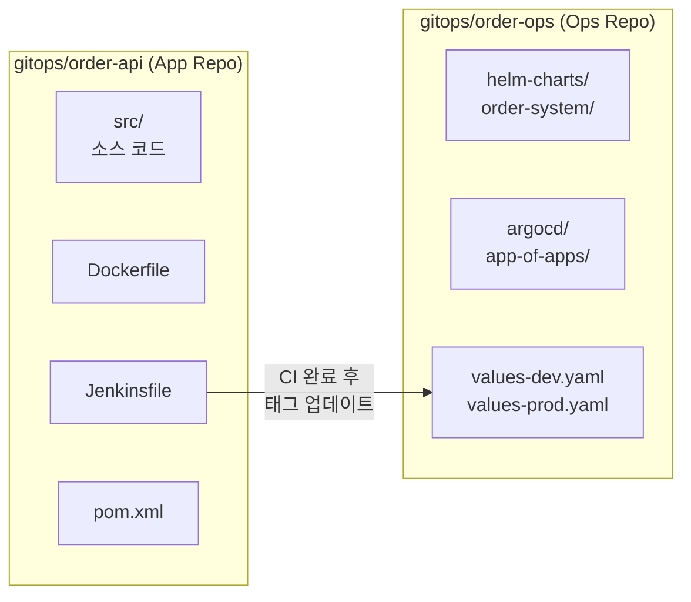
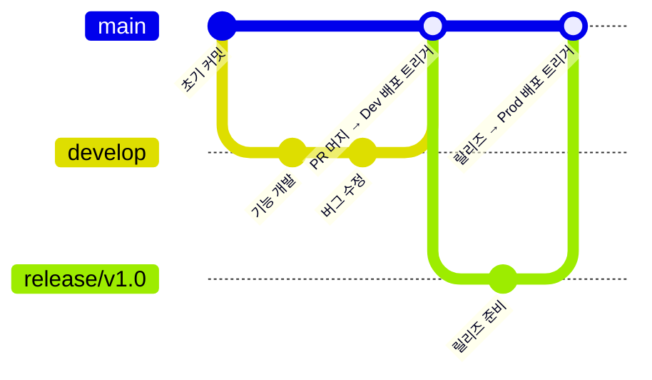

# 03. Gitea 설정 가이드

## 설치

```bash
helm repo add gitea-charts https://dl.gitea.io/charts/
helm repo update

helm upgrade --install gitea gitea-charts/gitea \
  --namespace gitea \
  --create-namespace \
  -f infrastructure/gitea/values.yaml \
  --wait --timeout=10m

# 설치 확인
kubectl get pods -n gitea
kubectl get svc -n gitea
```

---

## 초기 계정 및 리포지토리 설정

```bash
# 설정 스크립트 실행 (계정, 토큰, 리포지토리 자동 생성)
bash scripts/gitea-setup.sh
```

스크립트가 자동으로 수행하는 작업:

| 항목 | 설명 |
|------|------|
| Jenkins 봇 계정 생성 | `jenkins-bot` |
| API 토큰 발급 | `.jenkins-gitea-token` 파일에 저장 |
| 조직 생성 | `gitops` |
| App Repo 생성 | `gitops/order-api` |
| Ops Repo 생성 | `gitops/order-ops` |

---

## Jenkins Webhook 수동 설정

Gitea Web UI → `gitops/order-api` → Settings → Webhooks → Add Webhook

```
URL:         http://jenkins.local/gitea-webhook/post
Secret:      (Jenkins Gitea 플러그인에서 설정한 시크릿)
Trigger:     Push Events, Pull Request Events
```

---

## 리포지토리 구조



---

## 브랜치 전략



| 브랜치 | 배포 환경 | 자동 여부 |
|--------|----------|----------|
| `main` | Dev (order-dev) | 자동 |
| `release/*` | Prod (order-prod) | 수동 승인 후 |
| 기타 | 없음 | - |
