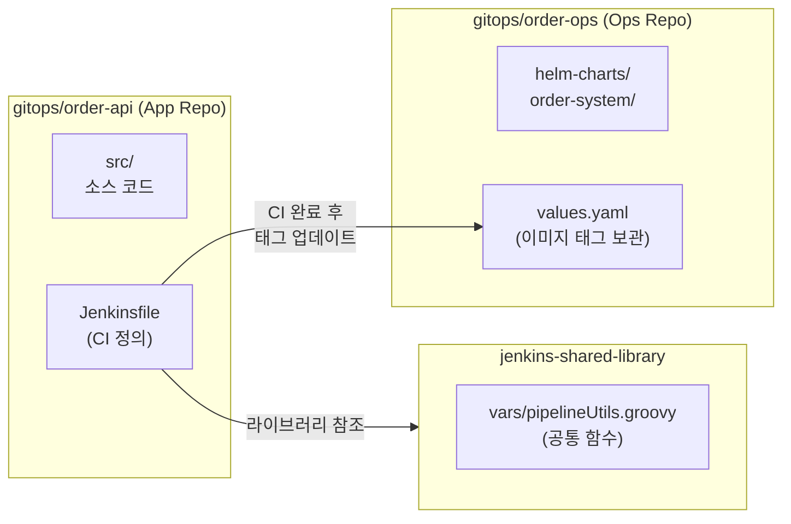

# 03. Gitea 설정 가이드

## 🏗️ 설치 및 자동화된 초기 설정

Gitea는 Helm을 통해 설치되며, `scripts/bootstrap.sh`의 일부로 모든 저장소와 계정이 자동 생성됩니다.

```bash
# Gitea 초기 설정 자동화 (계정, 토큰, 리포지토리, SSH 키 등록)
# 내부적으로 scripts/steps/step-09-setup.sh 에 의해 수행됩니다.
```

### 🤖 자동 구성 항목 (Automation)

| 항목 | 상세 내용 |
|------|------|
| **조직(Organization)** | `gitops` 조직 자동 생성 |
| **Jenkins 봇 계정** | `jenkins-bot` 계정 생성 및 관리자 권한 부여 |
| **SSH 키 등록** | `jenkins-bot` 계정에 Jenkins용 ED25519 공개키 자동 등록 |
| **저장소(Repos)** | `order-api` (App), `order-ops` (Ops), `jenkins-shared-library` 생성 |

---

## 🖇️ Jenkins Webhook 설정

본 프로젝트는 Jenkins의 `Generic Webhook Trigger`를 사용하여 빌드를 제어합니다.

### 자동 등록 (`setup-webhook.sh`)
`step-10-apps.sh` 실행 시, Gitea API를 통해 `order-api` 저장소에 다음 설정의 Webhook이 자동 등록됩니다.

- **Target URL**: `http://jenkins.local/generic-webhook-trigger/invoke?token=order-api-token-2024`
- **Events**: `Push`, `Pull Request`

### 수동 확인 경로
Gitea Web UI → `gitops/order-api` → Settings → Webhooks 에서 등록된 웹훅의 전송 상태와 페이로드 내용을 확인할 수 있습니다.

---

## 📂 리포지토리 구성 모델



---

## 🔑 SSH 접속 정보 (내부 네트워크)

K3s 클러스터 내부에서 Jenkins가 Gitea에 접근할 때는 Ingress 주소가 아닌 **Kubernetes Service 명** 또는 **커스텀 SSH 포트**를 사용합니다.

- **SSH 주소**: `ssh://git@gitea-ssh.gitea.svc.cluster.local:2222/gitops/order-api.git`
- **인증 방식**: `jenkins-bot` 계정의 SSH Key (JCasC로 Jenkins에 등록됨)

---

## 💡 참고: 브랜치 전략

- `main`: 개발 완료된 코드가 병합되는 브랜치로, `order-dev` 환경으로의 **자동 배포**를 트리거합니다.
- `release/*`: 운영 배포를 위한 브랜치로, 승인 절차를 거쳐 `order-prod` 환경으로 배포됩니다.
