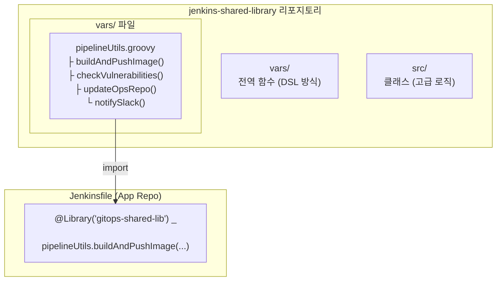
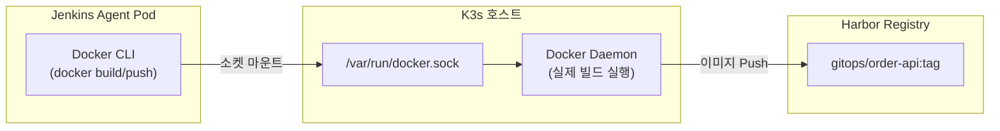
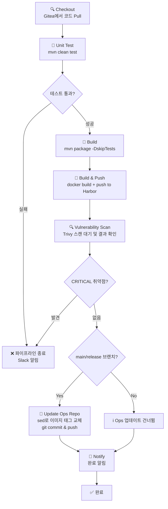

# 04. Jenkins 설정 가이드

## 설치

```bash
helm repo add jenkins https://charts.jenkins.io
helm repo update

# 시크릿 먼저 생성 (Gitea 토큰을 스크립트 실행 후 넣어야 한다)
GITEA_TOKEN=$(cat .jenkins-gitea-token)
kubectl create namespace jenkins --dry-run=client -o yaml | kubectl apply -f -
kubectl create secret generic jenkins-secrets \
  --namespace jenkins \
  --from-literal=gitea-token="${GITEA_TOKEN}" \
  --from-literal=harbor-password="Harbor12345" \
  --dry-run=client -o yaml | kubectl apply -f -

# Jenkins 설치
helm upgrade --install jenkins jenkins/jenkins \
  --namespace jenkins \
  --create-namespace \
  -f infrastructure/jenkins/values.yaml \
  --wait --timeout=15m
```

---

## Shared Library 구조



### 주요 함수 설명

| 함수 | 역할 |
|------|------|
| `buildAndPushImage()` | Docker 빌드 → Harbor Push (latest + 버전 태그) |
| `checkVulnerabilities()` | Trivy 스캔 완료 대기 → CRITICAL 취약점 확인 |
| `updateOpsRepo()` | Ops 리포지토리 `sed` 태그 업데이트 → git push |
| `notifySlack()` | Slack 채널 알림 (선택적) |

---

## DooD (Docker-outside-of-Docker) 방식



> **DooD 주의사항**: 호스트의 Docker Daemon을 공유하므로 보안에 유의해야 한다. 운영 환경에서는 `kaniko`를 사용하는 것을 권장한다.

---

## 파이프라인 흐름 다이어그램



---

## Maven 빌드 캐시 PVC 생성

```bash
kubectl apply -f - <<EOF
apiVersion: v1
kind: PersistentVolumeClaim
metadata:
  name: maven-cache-pvc
  namespace: jenkins
spec:
  accessModes: [ReadWriteOnce]
  storageClassName: local-path
  resources:
    requests:
      storage: 5Gi
EOF
```
