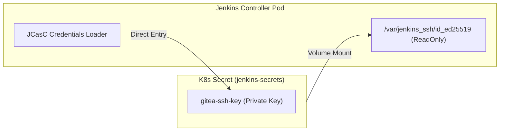

# 04. Jenkins 설정 가이드 (JCasC 중심)

## 개요

본 프로젝트의 Jenkins는 **JCasC(Jenkins Configuration as Code)**를 통해 코드 기반으로 설정됩니다. 이를 통해 인스턴스 재시작 시에도 동일한 설정(자격증명, 플러그인 설정, Job 정의 등)이 유지되며, 수동 설정의 번거로움을 최소화합니다.

---

## 🏗️ 설치 및 초기화

Jenkins는 Helm 차트를 통해 설치되며, `scripts/steps/step-07-jenkins.sh`에 의해 자동화됩니다.

```bash
# Jenkins 설치 (JCasC 설정 포함)
helm upgrade --install jenkins jenkins/jenkins \
  --namespace jenkins \
  --create-namespace \
  -f infrastructure/jenkins/values.yaml \
  --wait
```

### 🔐 시크릿 및 환경 변수 주입
JCasC 설정 내에서 사용되는 민감한 정보(토큰, 비밀번호, SSH 키)는 Kubernetes Secret(`jenkins-secrets`)을 통해 환경 변수로 주입됩니다.

| 환경 변수명 | 설명 | 주입처 |
|------|------|------|
| `GITEA_JENKINS_PASS` | Jenkins 봇 계정 비밀번호 | JCasC (Credentials) |
| `GITEA_SSH_KEY` | ED25519 Private Key | JCasC (SSH Credentials) |
| `HARBOR_ADMIN_PASSWORD` | Harbor 관리자 비밀번호 | JCasC (Credentials) |

---

## 🛠️ JCasC 주요 설정항목

`infrastructure/jenkins/values.yaml` 내 `controller.JCasC.configScripts` 섹션에서 관리됩니다.

### 1. 보안 설정 (Security)
Gitea로부터의 Webhook 수신 및 원활한 자동화를 위해 다음과 같은 권한 전략을 사용합니다.
- **Global Matrix Authorization**: 익명 사용자의 빌드 트리거 및 읽기 권한을 허용하여 Gitea Webhook이 인증 없이 Jenkins에 접근할 수 있도록 합니다.

### 2. Gitea 서버 및 자격증명
- **Local Gitea**: `http://gitea.local` 주소로 서버를 정의합니다.
- **Credentials**: `jenkins-bot` 계정을 위한 `usernamePassword` 및 `basicSSHUserPrivateKey` 자격증명을 자동으로 생성합니다.

### 3. 공유 라이브러리 (Shared Library)
- `gitops-shared-lib`이라는 이름의 라이브러리를 모든 파이프라인에서 **암시적(Implicit)**으로 로드하도록 설정합니다.
- 저장소: `http://gitea.local/gitops/jenkins-shared-library.git`

### 4. Job 자동 생성 (Job DSL)
- `order-api-pipeline`을 자동으로 생성하며, `Generic Webhook Trigger` 설정을 포함합니다.

---

## 🖇️ Gitea Webhook 연동 (Generic Webhook Trigger)

본 프로젝트는 Gitea 플러그인의 기본 기능을 확장하여, `generic-webhook-trigger`를 통해 더욱 세밀한 트리거 제어를 수행합니다.

- **Trigger URL**: `http://jenkins.local/generic-webhook-trigger/invoke?token=order-api-token-2024`
- **Token**: `order-api-token-2024` (JCasC Job DSL에 정의됨)
- **CSRF 방지 무시**: Gitea → Jenkins 통신 시 CSRF Crumb 오류를 방지하기 위해 JVM 옵션(`-Dhudson.plugins.git.GitStatus.NOTIFY_COMMIT_TOKEN_REQUIRED=false`)이 적용되어 있습니다.

---

## 🔑 SSH 인증 및 안정성 확보

Jenkins Pod에서 Gitea 리포지토리를 SSH로 클론할 때 발생할 수 있는 `libcrypto` 공유 라이브러리 로딩 이슈 및 키 파일 권한 문제를 해결하기 위해 다음과 같은 아키텍처를 채택했습니다.



- **Volume Mount**: SSH 키를 `/var/jenkins_ssh`에 읽기 전용으로 마운트하여 파일 권한(0400) 이슈를 해결합니다.
- **Direct Entry**: JCasC에서는 시크릿 값을 직접 스트링으로 읽어와 Jenkins 내부 자격증함에 등록합니다.

---

## 📂 Shared Library 구조 및 DooD 방식

(기존 내용 유지 시)
> 상세한 Shared Library 함수 설명 및 Docker 빌드 방식(DooD)은 상위 문서 및 `07-pipeline-flow.md`를 참고하세요.

---

## 🧪 Maven 빌드 캐시 설정

빌드 속도 향상을 위해 Maven 로컬 레포지토리(`.m2/repository`)를 PVC에 영구 보관합니다.
- **PVC 이름**: `maven-cache-pvc`
- **경로**: Jenkins Pod의 `/root/.m2/repository` (Agent Pod 설정 시 마운트)
