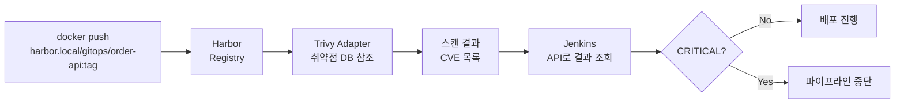
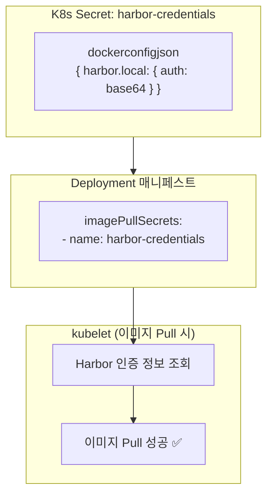

# 05. Harbor 설정 가이드

## 설치

```bash
helm repo add harbor https://helm.goharbor.io
helm repo update

helm upgrade --install harbor harbor/harbor \
  --namespace harbor \
  --create-namespace \
  -f infrastructure/harbor/values.yaml \
  --wait --timeout=15m

kubectl get pods -n harbor
```

---

## 초기 설정 자동화

```bash
bash scripts/harbor-setup.sh
```

수행 내용:

| 항목 | 설명 |
|------|------|
| 프로젝트 생성 | `gitops` 프로젝트 (public) |
| Trivy 자동 스캔 | 이미지 Push 시 자동 스캔 활성화 |
| imagePullSecrets | 각 네임스페이스에 harbor-credentials 생성 |

---

## Trivy 스캔 설정



### 스캔 결과 API 조회 예시

```bash
curl -u admin:Harbor12345 \
  "http://harbor.local/api/v2.0/projects/gitops/repositories/order-api/artifacts/main-abc12345/additions/vulnerabilities" \
  | jq '.["application/vnd.security.vulnerability.report; version=1.1"].summary'
```

---

## imagePullSecrets 상세 설명



### 수동 생성 방법

```bash
kubectl create secret docker-registry harbor-credentials \
  --namespace order-dev \
  --docker-server=harbor.local \
  --docker-username=admin \
  --docker-password=Harbor12345 \
  --docker-email=admin@harbor.local
```

---

## Harbor 프로젝트 정책 권장 설정

| 항목 | 설정값 | 이유 |
|------|--------|------|
| 자동 스캔 | 활성화 | Push 즉시 보안 검사 |
| 취약점 차단 | CRITICAL만 차단 | 운영 안정성 균형 |
| 이미지 보존 정책 | 최근 10개 유지 | 스토리지 관리 |
| 불변 태그 | `release-*` 패턴 | 운영 이미지 보호 |
