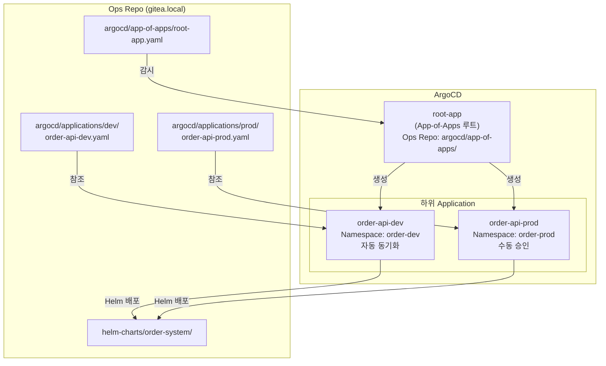
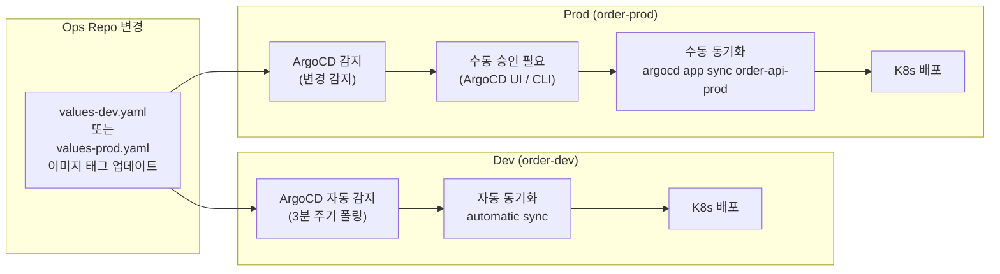
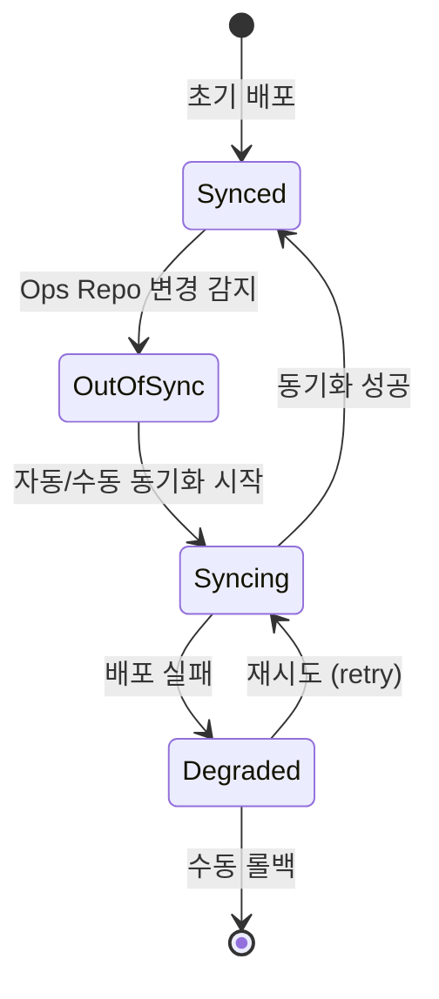

# 06. ArgoCD 설정 가이드

## 설치

```bash
helm repo add argo https://argoproj.github.io/argo-helm
helm repo update

helm upgrade --install argocd argo/argo-cd \
  --namespace argocd \
  --create-namespace \
  -f infrastructure/argocd/values.yaml \
  --wait --timeout=10m

# admin 초기 비밀번호 조회
kubectl get secret argocd-initial-admin-secret \
  -n argocd \
  -o jsonpath='{.data.password}' | base64 -d && echo
```

---

## App-of-Apps 패턴



---

## App-of-Apps 등록 및 확인

```bash
# root-app 등록 (최초 1회)
kubectl apply -f argocd/app-of-apps/root-app.yaml -n argocd

# ArgoCD CLI로 상태 확인 (선택적)
argocd login argocd.local --username admin --insecure
argocd app list
argocd app get root-app
argocd app get order-api-dev
```

---

## Dev vs Prod 동기화 전략



### Prod 수동 배포 명령어

```bash
# ArgoCD UI에서 "Sync" 버튼 클릭, 또는:
argocd app sync order-api-prod --prune
```

---

## 동기화 상태 다이어그램


