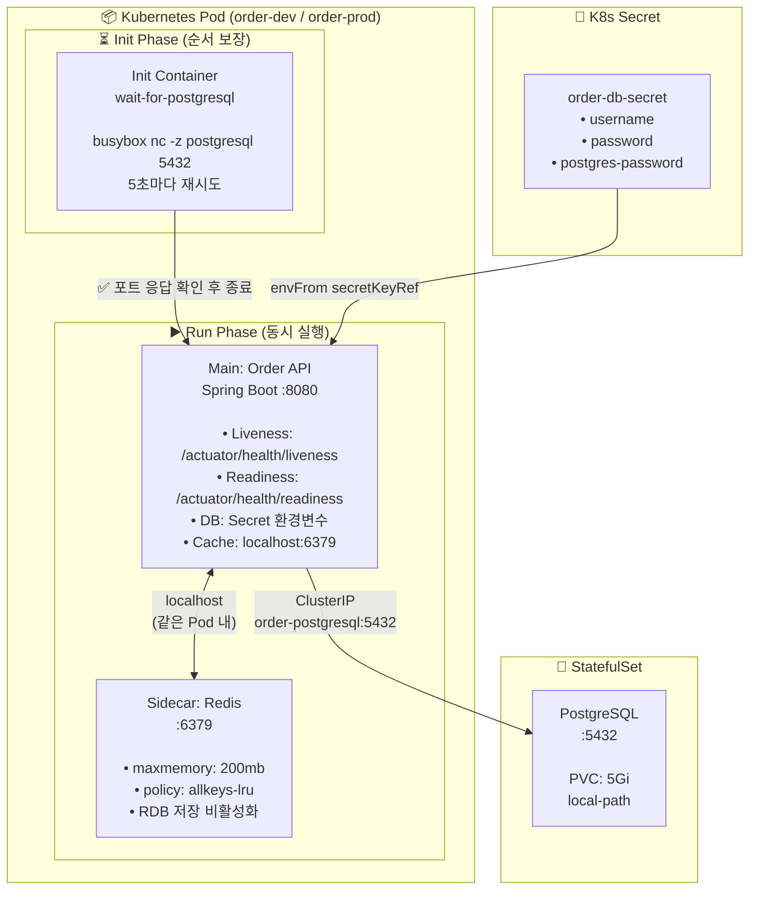
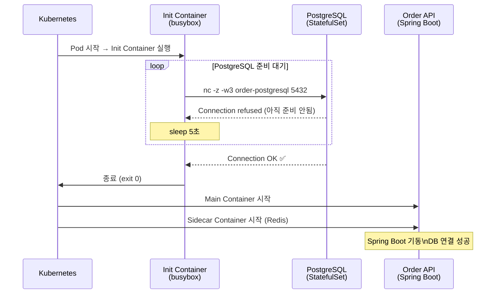
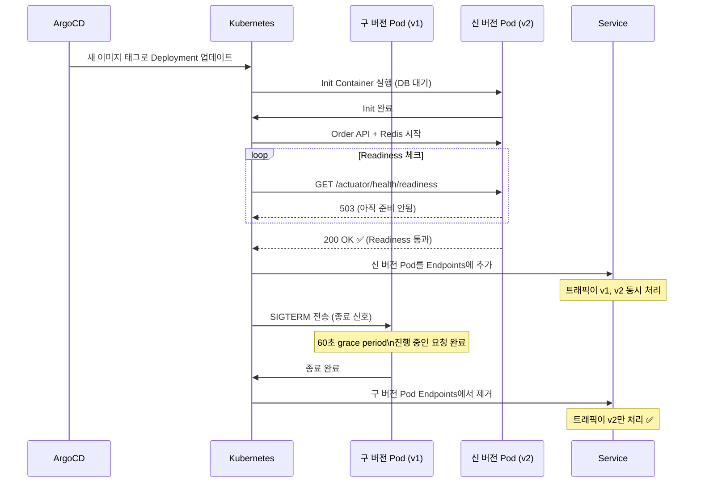
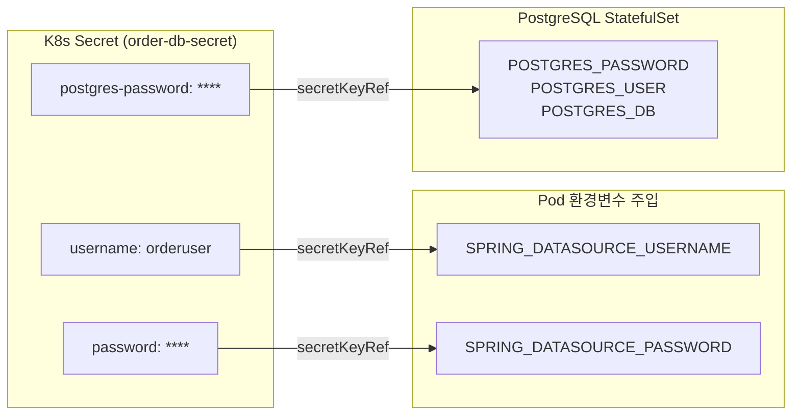
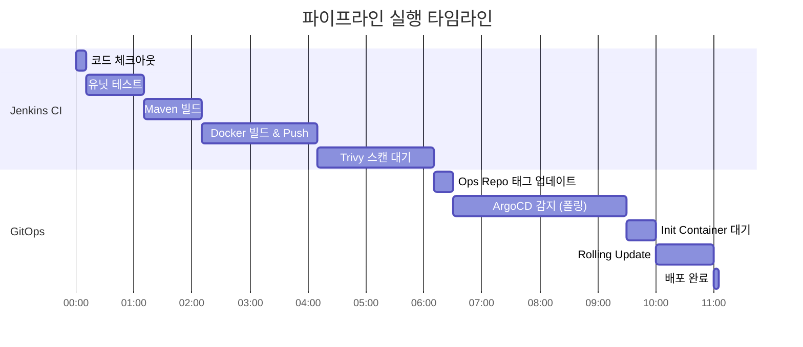

# 07. 파이프라인 흐름 및 Order System 배포 상세

## Order System 컴포넌트 구성



---

## Init Container 동작 원리



---

## 무중단 배포 흐름 (RollingUpdate)



---

## 헬스체크 엔드포인트 (Spring Boot Actuator)

| 엔드포인트 | 프로브 | 실패 시 동작 |
|-----------|--------|------------|
| `/actuator/health/liveness` | Liveness | Pod 재시작 |
| `/actuator/health/readiness` | Readiness | Service에서 제외 |

### Spring Boot 설정 (application-k8s.yml)

```yaml
management:
  endpoint:
    health:
      probes:
        enabled: true
      show-details: always
  endpoints:
    web:
      exposure:
        include: health,info,metrics,prometheus
  health:
    livenessState:
      enabled: true
    readinessState:
      enabled: true
```

---

## Secret 관리 흐름



---

## 전체 배포 타임라인 (예상 소요 시간)


